# Intelli-Credit Terminal

**Production-Grade Corporate Credit Appraisal System powered by Google Gemini AI**

</div>

## 🚀 Overview

Intelli-Credit Terminal is an advanced, automated corporate credit appraisal application designed to replicate and enhance professional banking workflows. Built with React, Express, and the Google GenAI SDK, it ingests financial documents, verifies data integrity, detects forensic fraud flags, and generates a comprehensive Credit Appraisal Memo (CAM).

## ✨ Key Features

- **Automated Data Ingestion:** Upload financial documents (PDF, CSV, JSON, TXT, Images). The built-in Express server extracts text and base64 data to feed into the AI engine.
- **Forensic Fraud Detection:** AI-powered identification of shell companies, circular transactions, asset inflation, and director/shareholder inconsistencies.
- **The Five Cs of Credit:** Deep-dive analysis scoring across Character, Capacity, Capital, Collateral, and Conditions.
- **Interactive Stress Testing:** Perform What-If scenarios by applying Revenue and Interest Rate shocks to instantly calculate stressed DSCR, ICR, and revised risk grades.
- **Bureau Integrations:** Support for both simulated (mock) and real external API connections (eCourts, MCA, CIBIL, LTV calculations).
- **Automated CAM Generation:** Instant generation of professional Credit Appraisal Memos with export options to PDF and JSON.

## 🛠 Tech Stack

- **Frontend:** React 19, Vite, Tailwind CSS v4, Lucide React, Recharts, Framer Motion
- **Backend:** Node.js, Express, Multer, PDF-Parse
- **AI/ML:** Google Gemini 1.5 Pro/Flash (`@google/genai`)
- **Document Generation:** jsPDF, html2canvas, html-to-image, React Markdown

## 📦 Prerequisites

- **Node.js** (v18 or higher)
- **Google Gemini API Key** (Get one from [Google AI Studio](https://aistudio.google.com/))

## ⚙️ Installation & Local Setup

1. **Clone the repository:**

<!-- AUTO-GENERATED-SECTION-START -->

## 🤖 Auto-Generated Repository Analytics


### Project Overview

- **Name:** react-example
- **Version:** 0.0.0
- **Detected Frameworks:** React, Express, Vite, TailwindCSS

### Technology Stack & Dependencies

- `@google/genai`
- `@tailwindcss/typography`
- `@tailwindcss/vite`
- `@vitejs/plugin-react`
- `clsx`
- `cors`
- `dotenv`
- `express`
- `express-rate-limit`
- `html-to-image`
- `html2canvas`
- `jspdf`
- `lucide-react`
- `motion`
- `multer`
- `pdf-parse`
- `react`
- `react-dom`
- `react-dropzone`
- `react-markdown`
- `recharts`
- `tailwind-merge`
- `vite`

### Available Scripts

| Script                       | Command                                        |
| ---------------------------- | ---------------------------------------------- |
| `npm run dev`                | `tsx server.ts`                                |
| `npm run build`              | `vite build`                                   |
| `npm run start`              | `node --experimental-strip-types server.ts`    |
| `npm run preview`            | `vite preview`                                 |
| `npm run clean`              | `rm -rf dist`                                  |
| `npm run format`             | `prettier --write .`                           |
| `npm run lint`               | `tsc --noEmit`                                 |
| `npm run lint:fix`           | `eslint . --fix`                               |
| `npm run test`               | `vitest run`                                   |
| `npm run test:watch`         | `vitest`                                       |
| `npm run analyze:repo`       | `tsx scripts/automation/repo-analyzer.ts`      |
| `npm run generate:diagrams`  | `tsx scripts/automation/generate-diagrams.ts`  |
| `npm run generate:readme`    | `tsx scripts/automation/generate-readme.ts`    |
| `npm run ai:review`          | `tsx scripts/automation/ai-reviewer.ts`        |
| `npm run generate:dashboard` | `tsx scripts/automation/generate-dashboard.ts` |
| `npm run fix`                | `tsx scripts/automation/auto-fix.ts`           |

### Environment Variables

All keys are **server-side only** — the client never sees them. Every Gemini
and bureau call goes through the `/api/analyze` serverless function.

| Variable          | Required | Description                                                                                |
| ----------------- | -------- | ------------------------------------------------------------------------------------------ |
| `GEMINI_API_KEY`  | Yes      | Google Gemini API key. Get one at https://aistudio.google.com/apikey                       |
| `ECOURTS_API_KEY` | No       | eCourts key for the `search_cases` tool. When unset, that tool returns a helpful error.    |

**Local dev:** copy `.env.example` to `.env` and fill in the values. `server.ts`
loads `.env` via dotenv and exposes them to the dev `/api/analyze` route.

**Vercel:** add each value under **Settings → Environment Variables** (no `VITE_`
prefix). They are injected into the serverless function at runtime and never
reach the browser bundle.

### Architecture & System Design

# Architecture & Dependencies

This diagram is auto-generated based on the repository structure and dependencies.

```mermaid
graph TD;
  Root["react-example"]
  Root --> Root__env_example[".env.example"]
  Root --> Root__github[".github"]
  Root__github --> Root__github_CODEOWNERS["CODEOWNERS"]
  Root__github --> Root__github_ISSUE_TEMPLATE["ISSUE_TEMPLATE"]
  Root__github_ISSUE_TEMPLATE --> Root__github_ISSUE_TEMPLATE_bug_report_yml["bug_report.yml"]
  Root__github_ISSUE_TEMPLATE --> Root__github_ISSUE_TEMPLATE_feature_request_yml["feature_request.yml"]
  Root__github --> Root__github_PULL_REQUEST_TEMPLATE["PULL_REQUEST_TEMPLATE"]
  Root__github_PULL_REQUEST_TEMPLATE --> Root__github_PULL_REQUEST_TEMPLATE_pull_request_template_md["pull_request_template.md"]
  Root__github --> Root__github_dependabot_yml["dependabot.yml"]
  Root__github --> Root__github_labeler_yml["labeler.yml"]
  Root__github --> Root__github_workflows["workflows"]
  Root__github_workflows --> Root__github_workflows_ai_documentation_agent_yml["ai-documentation-agent.yml"]
  Root__github_workflows --> Root__github_workflows_auto_assign_yml["auto-assign.yml"]
  Root__github_workflows --> Root__github_workflows_auto_fix_yml["auto-fix.yml"]
  Root__github_workflows --> Root__github_workflows_autonomous_repo_analysis_yml["autonomous-repo-analysis.yml"]
  Root__github_workflows --> Root__github_workflows_ci_cd_automation_yml["ci-cd-automation.yml"]
  Root__github_workflows --> Root__github_workflows_codeql_yml["codeql.yml"]
  Root__github_workflows --> Root__github_workflows_dependency_review_yml["dependency-review.yml"]
  Root__github_workflows --> Root__github_workflows_greetings_yml["greetings.yml"]
  Root__github_workflows --> Root__github_workflows_labeler_yml["labeler.yml"]
  Root__github_workflows --> Root__github_workflows_repo_health_dashboard_yml["repo-health-dashboard.yml"]
  Root__github_workflows --> Root__github_workflows_self_updating_readme_yml["self-updating-readme.yml"]
  Root__github_workflows --> Root__github_workflows_stale_yml["stale.yml"]
  Root --> Root__gitignore[".gitignore"]
  Root --> Root__prettierrc[".prettierrc"]
  Root --> Root_CODE_OF_CONDUCT_md["CODE_OF_CONDUCT.md"]
  Root --> Root_CONTRIBUTING_md["CONTRIBUTING.md"]
  Root --> Root_README_md["README.md"]
  Root --> Root_SECURITY_md["SECURITY.md"]
  Root --> Root_cycle_1_report_md["cycle_1_report.md"]
  Root --> Root_cycle_2_report_md["cycle_2_report.md"]
  Root --> Root_cycle_3_report_md["cycle_3_report.md"]
  Root --> Root_cycle_4_report_md["cycle_4_report.md"]
  Root --> Root_cycle_5_report_md["cycle_5_report.md"]
  Root --> Root_cycle_6_report_md["cycle_6_report.md"]
  Root --> Root_cycle_7_report_md["cycle_7_report.md"]
  Root --> Root_dev["dev"]
  Root_dev --> Root_dev_plan_md["plan.md"]
  Root --> Root_docs["docs"]
  Root_docs --> Root_docs_architecture["architecture"]
  Root_docs_architecture --> Root_docs_architecture_SERVICE_MAP_md["SERVICE_MAP.md"]
  Root_docs_architecture --> Root_docs_architecture_dependency_graph_md["dependency-graph.md"]
  Root_docs --> Root_docs_dashboard_html["dashboard.html"]
  Root --> Root_eslint_config_mjs["eslint.config.mjs"]
  Root --> Root_index_html["index.html"]
  Root --> Root_metadata_json["metadata.json"]
  Root --> Root_package_lock_json["package-lock.json"]
  Root --> Root_package_json["package.json"]
  Root --> Root_scripts["scripts"]
  Root_scripts --> Root_scripts_automation["automation"]
  Root_scripts_automation --> Root_scripts_automation_ai_reviewer_ts["ai-reviewer.ts"]
  Root_scripts_automation --> Root_scripts_automation_auto_fix_ts["auto-fix.ts"]
  Root_scripts_automation --> Root_scripts_automation_generate_dashboard_ts["generate-dashboard.ts"]
  Root_scripts_automation --> Root_scripts_automation_generate_diagrams_ts["generate-diagrams.ts"]
  Root_scripts_automation --> Root_scripts_automation_generate_readme_ts["generate-readme.ts"]
  Root_scripts_automation --> Root_scripts_automation_repo_analyzer_ts["repo-analyzer.ts"]
  Root --> Root_server_ts["server.ts"]
  Root --> Root_src["src"]
  Root_src --> Root_src_App_tsx["App.tsx"]
  Root_src --> Root_src___tests__["__tests__"]
  Root_src___tests__ --> Root_src___tests___App_test_tsx["App.test.tsx"]
  Root_src --> Root_src_components["components"]
  Root_src_components --> Root_src_components_ActionRecommendation_tsx["ActionRecommendation.tsx"]
  Root_src_components --> Root_src_components_CAMReport_tsx["CAMReport.tsx"]
  Root_src_components --> Root_src_components_CompanyProfile_tsx["CompanyProfile.tsx"]
  Root_src_components --> Root_src_components_DataIngestion_tsx["DataIngestion.tsx"]
  Root_src_components --> Root_src_components_DecisionPanel_tsx["DecisionPanel.tsx"]
  Root_src_components --> Root_src_components_ErrorDisplay_tsx["ErrorDisplay.tsx"]
  Root_src_components --> Root_src_components_FinancialMetrics_tsx["FinancialMetrics.tsx"]
  Root_src_components --> Root_src_components_FiveCsAnalysis_tsx["FiveCsAnalysis.tsx"]
  Root_src_components --> Root_src_components_FraudFlags_tsx["FraudFlags.tsx"]
  Root_src_components --> Root_src_components_IndustryBenchmarking_tsx["IndustryBenchmarking.tsx"]
  Root_src_components --> Root_src_components_IndustryBenchmarkingPanel_tsx["IndustryBenchmarkingPanel.tsx"]
  Root_src_components --> Root_src_components_IntelligenceRow_tsx["IntelligenceRow.tsx"]
  Root_src_components --> Root_src_components_LoanRecommendationPanel_tsx["LoanRecommendationPanel.tsx"]
  Root_src_components --> Root_src_components_RiskDimensions_tsx["RiskDimensions.tsx"]
  Root_src_components --> Root_src_components_RiskScorePanel_tsx["RiskScorePanel.tsx"]
  Root_src_components --> Root_src_components_StressTestingModule_tsx["StressTestingModule.tsx"]
  Root_src_components --> Root_src_components_StressTestingPanel_tsx["StressTestingPanel.tsx"]
  Root_src_components --> Root_src_components_VerificationEngine_tsx["VerificationEngine.tsx"]
  Root_src_components --> Root_src_components___tests__["__tests__"]
  Root_src --> Root_src_constants_ts["constants.ts"]
  Root_src --> Root_src_index_css["index.css"]
  Root_src --> Root_src_lib["lib"]
  Root_src_lib --> Root_src_lib___tests__["__tests__"]
  Root_src_lib --> Root_src_lib_export_ts["export.ts"]
  Root_src_lib --> Root_src_lib_file_utils_test_ts["file-utils.test.ts"]
  Root_src_lib --> Root_src_lib_file_utils_ts["file-utils.ts"]
  Root_src_lib --> Root_src_lib_gemini_config_ts["gemini-config.ts"]
  Root_src_lib --> Root_src_lib_gemini_ts["gemini.ts"]
  Root_src_lib --> Root_src_lib_utils_test_ts["utils.test.ts"]
  Root_src_lib --> Root_src_lib_utils_ts["utils.ts"]
  Root_src --> Root_src_main_tsx["main.tsx"]
  Root_src --> Root_src_services["services"]
  Root_src_services --> Root_src_services___tests__["__tests__"]
  Root_src_services --> Root_src_services_analysisService_ts["analysisService.ts"]
  Root_src --> Root_src_types_ts["types.ts"]
  Root_src --> Root_src_vite_env_d_ts["vite-env.d.ts"]
  Root --> Root_test_pdf_ts["test-pdf.ts"]
  Root --> Root_test_pdf2_ts["test-pdf2.ts"]
  Root --> Root_tsconfig_json["tsconfig.json"]
  Root --> Root_vercel_json["vercel.json"]
  Root --> Root_vite_config_ts["vite.config.ts"]
  subgraph Dependencies
    Root --> Dep__google_genai["@google/genai"]
    Root --> Dep__tailwindcss_typography["@tailwindcss/typography"]
    Root --> Dep__tailwindcss_vite["@tailwindcss/vite"]
    Root --> Dep__vitejs_plugin_react["@vitejs/plugin-react"]
    Root --> Dep_clsx["clsx"]
    Root --> Dep_cors["cors"]
    Root --> Dep_dotenv["dotenv"]
    Root --> Dep_express["express"]
    Root --> Dep_express_rate_limit["express-rate-limit"]
    Root --> Dep_html_to_image["html-to-image"]
    Root --> Dep_More["...and 13 more"]
  end
```



### Setup & Deployment Instructions

1. **Install Dependencies:**
   ```bash
   npm ci
   ```
2. **Set Environment Variables:**
   Copy `.env.example` to `.env` and configure appropriately.
3. **Run Application:**
   ```bash
   npm run dev
   ```
4. **Deployment:**
   Configure your deployment target (e.g., Vercel, Node server) to run the `build` script and serve the output directory.

### AI Automated Maintenance

This repository is self-maintaining:

- **CI/CD Automation:** Runs tests, linting, and security audits automatically.
- **Repository Analysis:** Weekly scheduled tasks map the codebase structure.
- **AI Documentation Agent:** An AI automatically reviews PRs and updates documentation based on detected architectural changes.

<!-- AUTO-GENERATED-SECTION-END -->
