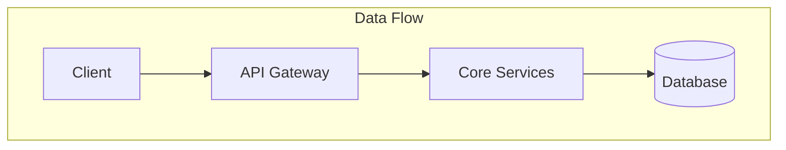

# Data Flow

This diagram is auto-generated representing a generalized data flow.

```mermaid
graph TD;
  subgraph Data Flow
    Client --> API_Gateway["API Gateway"]
    API_Gateway --> Services["Core Services"]
    Services --> DB[(Database)]
  end
```