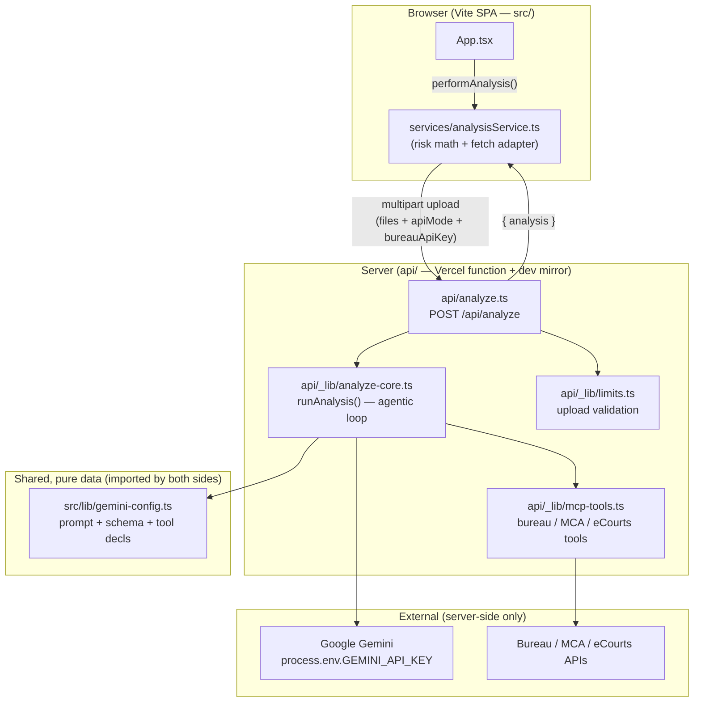

# Service Map

How data and dependencies flow through Intelli-Credit. The defining
architectural fact is the **client / serverless split**: the browser never
holds the Gemini key — all AI and bureau access is proxied through the
`/api/analyze` Vercel serverless function (mirrored locally by `server.ts`).

## Key invariants

- **Secrets never cross to the client.** `GEMINI_API_KEY` and `ECOURTS_API_KEY`
  are read from `process.env` only inside `api/_lib/*` and `server.ts`.
- **One core, two hosts.** `runAnalysis` is environment-agnostic; both the
  production function (`api/analyze.ts`) and the dev harness (`server.ts`)
  call it, so dev and prod behavior are identical.
- **Client keeps the cheap math.** `calculateRiskAndFraud` and
  `calculateDisplayAnalysis` (stress testing) are pure functions that run in
  the browser on the analysis JSON returned by the server.

