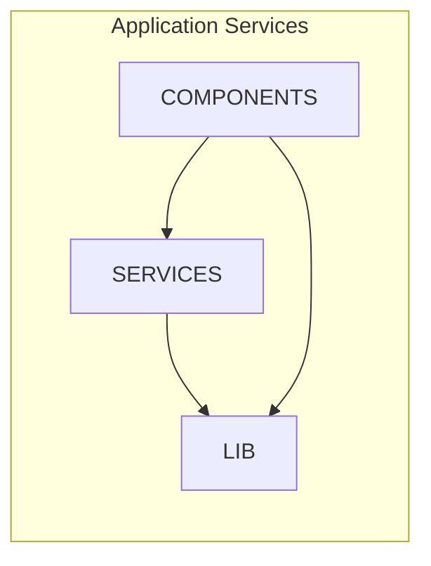

# Service Map

This diagram is auto-generated based on the application's source modules.

```mermaid
graph LR;
  subgraph Application Services
    components["COMPONENTS"]
    lib["LIB"]
    services["SERVICES"]
    components --> services
    services --> lib
    components --> lib
  end
```
